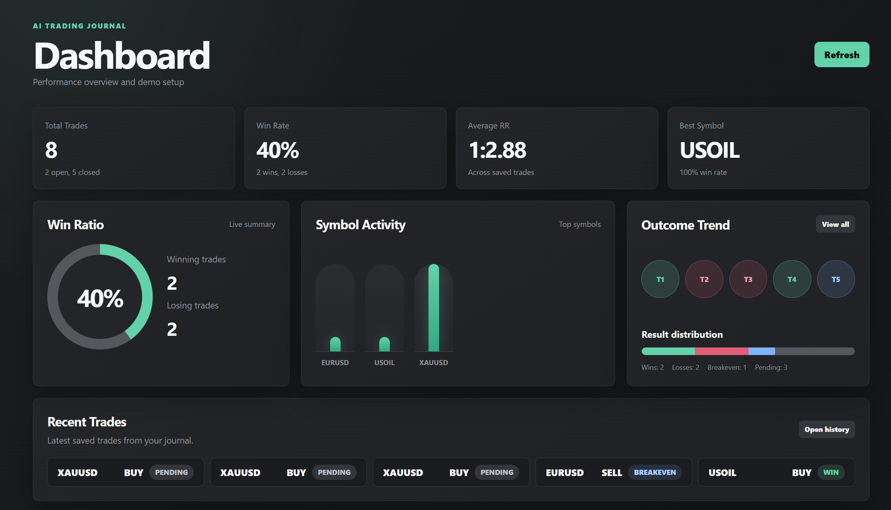
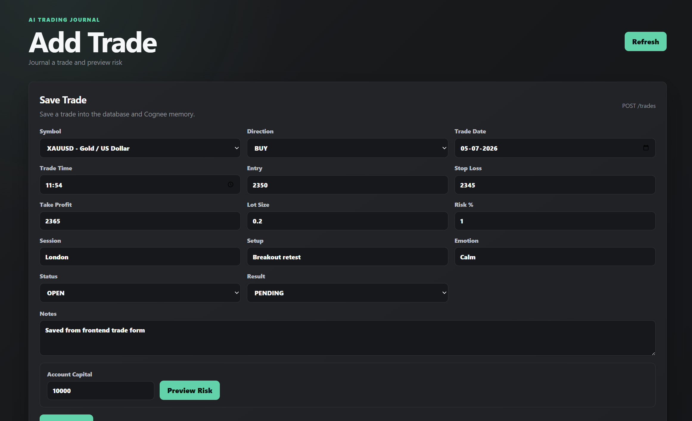
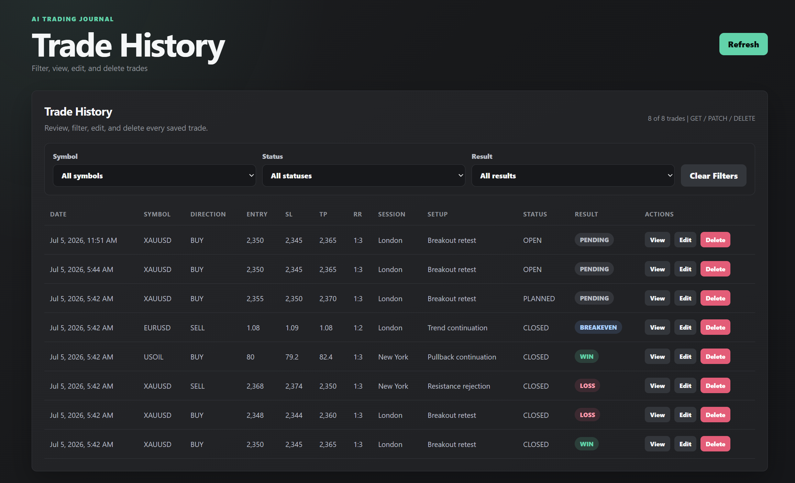
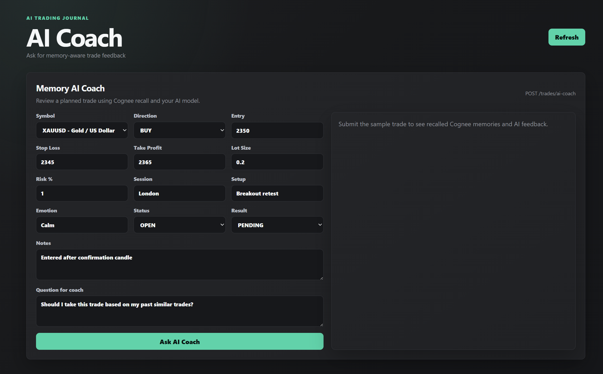
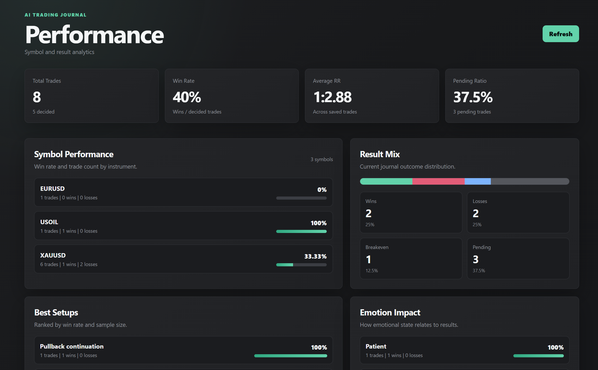
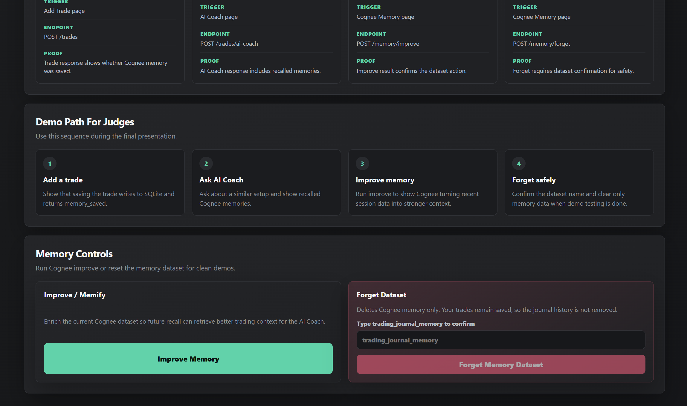
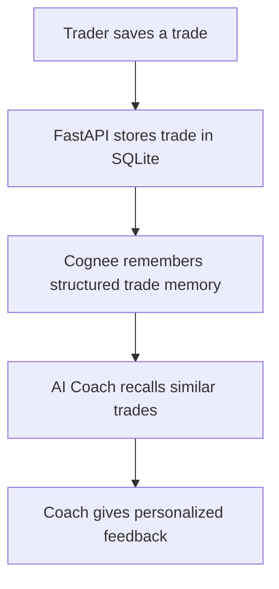
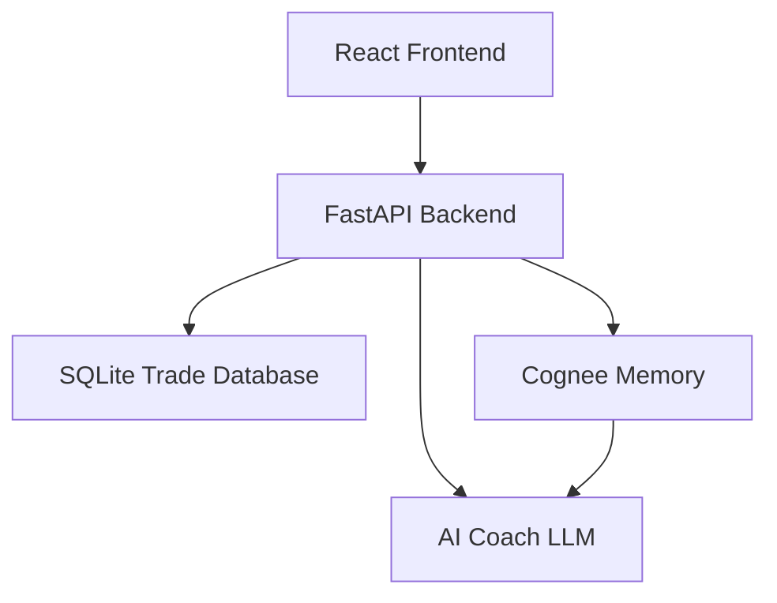

# AI Trading Journal

AI Trading Journal is a memory-powered trading journal and coaching assistant. It helps traders save trades, review risk, analyze performance, recall similar past setups, and receive personalized AI coaching based on their own trading history.

## Live Demo

| Resource          | Link |
| ----------------- | ---- |
| Deployed App      | `https://ai-trading-journal-phi.vercel.app`   |
| Demo Video        | `https://youtu.be/-4sPjEYPebw`   |
| GitHub Repository | `https://github.com/Nav-33n/AI-Trading-Journal`   |

## Project Screenshots

| Page          | Screenshot                                                                                                 |
| ------------- | ---------------------------------------------------------------------------------------------------------- |
| Dashboard     |                                                                |
| Add Trade     |                                                                |
| Trade History |                                                        |
| AI Coach      |                                                                  |
| Performance   |                                                            |
| Cognee Memory |   |

## About The Project

Most trading journals only store trade records. This project turns the journal into a learning assistant.

The trader can record a trade with price levels, risk percentage, lot size, session, setup, emotion, notes, status, and result. The backend stores the trade in SQLite and also sends a structured version of that trade to Cognee memory. Later, when the trader asks the AI Coach for feedback, the app recalls similar historical trades from Cognee and uses them as context for a personalized review.

The goal is not to create an auto-trading bot. The goal is to help traders become more disciplined by learning from their own past behavior.

## Problem

Traders often repeat the same mistakes:

- entering too early
- ignoring stop loss rules
- overtrading after losses
- exiting early because of fear
- performing better in some sessions than others without noticing it

A normal journal requires the trader to manually review all of this. AI Trading Journal uses memory to make that review easier and more personal.

## Solution

AI Trading Journal provides:

- a trade journal for recording planned, open, and closed trades
- risk preview before saving a trade
- performance dashboard with win rate, average RR, symbol activity, and outcome trend
- trade history with filtering, editing, deleting, and detail view
- AI Coach that gives feedback using recalled trade memories
- Cognee Memory page showing remember, recall, improve, and forget lifecycle
- demo seed flow for quick hackathon presentation

## How Cognee Is Used

Cognee is the core memory layer of this project. It is not added as a small side feature; it directly powers the AI coaching workflow.

| Cognee Lifecycle | Where It Is Used                                  | What Happens                                                                   |
| ---------------- | ------------------------------------------------- | ------------------------------------------------------------------------------ |
| Remember         | `POST /trades`                                    | Every saved trade is converted into structured memory and stored in Cognee.    |
| Recall           | `POST /memory/recall` and `POST /trades/ai-coach` | Similar past trades are retrieved before the AI Coach gives feedback.          |
| Improve / Memify | `POST /memory/improve`                            | Cognee improves memory so future recall becomes more useful.                   |
| Forget           | `POST /memory/forget`                             | The memory dataset can be reset during testing without deleting SQLite trades. |

### Memory Flow



### Example Stored Memory

```text
Trading journal memory.
Trade ID: 10.
Trade time: 2026-07-03 10:30:00.
Symbol: XAUUSD.
Direction: BUY.
Entry price: 2350.
Stop loss: 2345.
Take profit: 2365.
Session: London.
Setup: Breakout retest.
Emotion: Calm.
Result: PENDING.
Notes: Entered after confirmation candle.
```

### Why Cognee Matters Here

Without Cognee, the AI Coach can only review the current trade. With Cognee, the coach can compare the current trade against previous trades, repeated setups, emotional patterns, and historical outcomes. This makes the feedback personal instead of generic.

## Key Features

### Dashboard

The dashboard gives a quick performance overview:

- total trades
- win rate
- average risk/reward
- best symbol
- symbol activity chart
- recent outcome trend
- result distribution
- demo trade seeding

### Add Trade

The Add Trade page lets users save a complete journal entry:

- symbol and direction
- manual trade date and time
- entry, stop loss, and take profit
- lot size and risk percentage
- session, setup, emotion, and notes
- trade status and result
- risk preview before saving

Saving a trade stores it in SQLite and sends it to Cognee memory.

### Trade History

The Trade History page supports:

- filtering by symbol
- filtering by status
- filtering by result
- viewing a full trade detail page
- editing trades
- deleting trades

### Trade Detail

The Trade Detail page shows:

- price plan
- risk/reward
- position risk
- trade state
- journal notes
- emotion and setup
- direct actions for edit, delete, and AI Coach

### AI Coach

The AI Coach reviews a planned or saved trade with memory context. It recalls similar trades from Cognee and returns structured feedback:

- memory match
- risk check
- setup quality
- coaching advice
- one rule to follow

### Cognee Memory Page

The Cognee page explains and controls the memory lifecycle:

- Remember
- Recall
- Improve / Memify
- Forget

It also gives a demo path for judges to understand how memory is integrated into the app.

## Tech Stack

| Layer             | Technology                                            |
| ----------------- | ----------------------------------------------------- |
| Frontend          | React, Vite, CSS                                      |
| Backend           | Python, FastAPI                                       |
| Database          | SQLite                                                |
| ORM               | SQLAlchemy                                            |
| Validation        | Pydantic                                              |
| Memory Layer      | Cognee                                                |
| Cognee LLM        | Google AI Studio / Gemini                             |
| Cognee Embeddings | FastEmbed                                             |
| AI Coach          | OpenAI-compatible API, configured for Groq by default |
| API Docs          | FastAPI Swagger UI                                    |

## Architecture



### Frontend Structure

```text
frontend/src
├── components
├── data
├── pages
├── services
└── utils
```

### Backend Structure

```text
backend/app
├── routes
├── services
├── config.py
├── database.py
├── main.py
├── models.py
└── schemas.py
```

## Main API Endpoints

| Method   | Endpoint               | Purpose                             |
| -------- | ---------------------- | ----------------------------------- |
| `GET`    | `/health`              | Backend health check                |
| `GET`    | `/dashboard/summary`   | Dashboard statistics                |
| `POST`   | `/trades`              | Save trade and remember in Cognee   |
| `GET`    | `/trades`              | List saved trades                   |
| `GET`    | `/trades/{trade_id}`   | Get one trade                       |
| `PATCH`  | `/trades/{trade_id}`   | Update trade                        |
| `DELETE` | `/trades/{trade_id}`   | Delete trade                        |
| `POST`   | `/trades/risk-preview` | Preview risk and suggested lot size |
| `POST`   | `/trades/ai-coach`     | Get memory-aware AI coaching        |
| `POST`   | `/trades/demo-seed`    | Add demo trades                     |
| `GET`    | `/memory/status`       | Check Cognee settings               |
| `POST`   | `/memory/recall`       | Recall similar memories             |
| `POST`   | `/memory/improve`      | Improve / memify memory             |
| `POST`   | `/memory/forget`       | Forget Cognee dataset               |

## Demo Flow

Use this flow in the demo video:

1. Open the dashboard and show the dark trading UI.
2. Seed demo trades or add a trade manually.
3. Show that the dashboard updates.
4. Open Trade History and filter trades.
5. Open a Trade Detail page.
6. Click Ask AI Coach or open the AI Coach page manually.
7. Ask the coach to review a similar setup.
8. Show recalled Cognee memories in the response.
9. Open Cognee Memory page.
10. Explain Remember, Recall, Improve, and Forget.

## Local Setup

### Backend

```powershell
cd backend
python -m venv .venv
.\.venv\Scripts\Activate.ps1
pip install -r requirements.txt
copy .env.example .env
uvicorn app.main:app --reload
```

Backend docs:

```text
http://127.0.0.1:8000/docs
```

### Frontend

```powershell
cd frontend
npm install
npm run dev
```

Frontend app:

```text
http://localhost:5173
```

If your backend URL changes, create `frontend/.env`:

```env
VITE_API_BASE_URL=http://127.0.0.1:8000
```

## Environment Variables

Create `backend/.env` from `backend/.env.example`.

```env
APP_NAME=AI Trading Journal API
APP_ENV=development
DATABASE_URL=sqlite:///./trading_journal.db

AI_PROVIDER=groq
AI_API_KEY=
GROQ_API_KEY=
AI_BASE_URL=https://api.groq.com/openai/v1
AI_MODEL=llama-3.3-70b-versatile
AI_TIMEOUT_SECONDS=30
AI_MAX_OUTPUT_TOKENS=800

COGNEE_ENABLED=true
COGNEE_DATASET_NAME=trading_journal_memory
COGNEE_SESSION_ID=default_trader
ENABLE_BACKEND_ACCESS_CONTROL=false

LLM_PROVIDER=gemini
LLM_MODEL=gemini/gemini-2.5-flash-lite
LLM_API_KEY=
EMBEDDING_PROVIDER=fastembed
EMBEDDING_MODEL=sentence-transformers/all-MiniLM-L6-v2
EMBEDDING_DIMENSIONS=384
```

Do not commit `.env`, `.venv`, database files, `node_modules`, `dist`, or `__pycache__`.

## Sample Trade Request

```json
{
  "symbol": "XAUUSD",
  "direction": "BUY",
  "created_at": "2026-07-03T10:30:00",
  "entry_price": 2350,
  "stop_loss": 2345,
  "take_profit": 2365,
  "lot_size": 0.2,
  "risk_percent": 1,
  "session": "London",
  "setup": "Breakout retest",
  "emotion": "Calm",
  "notes": "Entered after confirmation candle",
  "status": "OPEN",
  "result": "PENDING"
}
```

## What I Learned

This project helped me understand how memory changes an AI application. A normal AI feature only reacts to the current prompt. With Cognee, the app can keep useful historical context and bring it back when needed.

Important learning points:

- designing a memory lifecycle around real user actions
- connecting FastAPI, SQLite, Cognee, and an AI coach
- handling LLM and embedding provider configuration
- using FastEmbed to reduce dependency on paid embedding APIs
- designing a UI that clearly explains the memory system to judges
- debugging API validation, dependency conflicts, quota limits, and memory recall behavior

## Future Improvements

- add authentication and separate memories per user
- add chart screenshot upload for each trade
- add broker import/export support
- add more advanced performance analytics
- add daily, weekly, and monthly trading review reports
- add automated mistake pattern detection
- add memory-based rule reminders before entering a trade

## AI Usage Disclosure

AI assistants were used during planning, debugging, code generation, UI refinement, and README drafting. The project idea, implementation decisions, testing, and final submission remain the responsibility of the project author.

## Submission Notes

This project was built for a Cognee-focused hackathon. The main scoring idea is that Cognee is used as the memory layer throughout the product, not only as a small integration. The journal remembers trades, recalls similar setups, improves memory, and can forget memory safely during testing.
